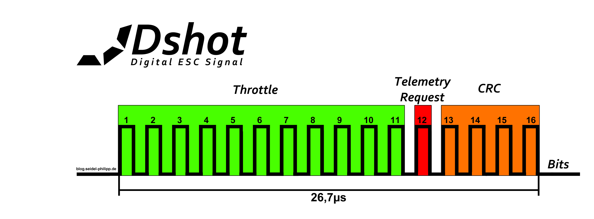

# Notes

## Protokoll information
###  Loop rate
Name       | Speed       | Comment
--------   | --------    | --------
DSHOT150   | 4kHz max    | 
DSHOT300   | 10,6kHz max | Only available on 32khz gyro boards
DSHOT600   | 16kHz max   | 
DSHOT1200  | >32khz max  | Currently only KISS24 supports DSHOT1200

32kHz ≙ 31.25 µs

### Digital Values
- 0 = disarmed.
- 1 to 47 = Reserved for special commands.
- 48 to 2047 = Active throttle control.

### CRC
https://www.mikrocontroller.net/articles/CRC 

## Things to remember  
- [ ] minimum/idle throtle 
- [ ] 